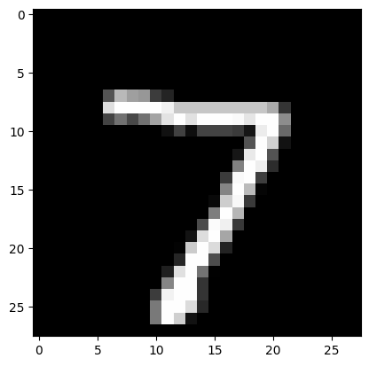

```python
import torch
import torch.nn as nn
import torch.utils.data as Data
import torchvision
import torch.nn.functional as F
import numpy as np

# torch.manual_seed(1)

EPOCH = 2
LR = 0.001
DOWNLOAD_MNIST = True

train_data = torchvision.datasets.MNIST(root='./mnist/', train=True, transform=torchvision.transforms.ToTensor(),
                                        download=DOWNLOAD_MNIST, )
test_data = torchvision.datasets.MNIST(root='./mnist/', train=False)

print(train_data.train_data.shape)

train_x = torch.unsqueeze(train_data.train_data, dim=1).type(torch.FloatTensor) / 255.
train_y = train_data.train_labels
print(train_x.shape)

test_x = torch.unsqueeze(test_data.test_data, dim=1).type(torch.FloatTensor)[:2000] / 255.  # Tensor on GPU
test_y = test_data.test_labels[:2000]
```

    torch.Size([60000, 28, 28])
    torch.Size([60000, 1, 28, 28])
    

    D:\02myAnaconda\envs\pytorch\lib\site-packages\torchvision\datasets\mnist.py:58: UserWarning: train_data has been renamed data
      warnings.warn("train_data has been renamed data")
    D:\02myAnaconda\envs\pytorch\lib\site-packages\torchvision\datasets\mnist.py:48: UserWarning: train_labels has been renamed targets
      warnings.warn("train_labels has been renamed targets")
    D:\02myAnaconda\envs\pytorch\lib\site-packages\torchvision\datasets\mnist.py:63: UserWarning: test_data has been renamed data
      warnings.warn("test_data has been renamed data")
    D:\02myAnaconda\envs\pytorch\lib\site-packages\torchvision\datasets\mnist.py:53: UserWarning: test_labels has been renamed targets
      warnings.warn("test_labels has been renamed targets")
    


```python
train_y.shape
```


    torch.Size([60000])


```python
print(train_y[:10])
```

    tensor([5, 0, 4, 1, 9, 2, 1, 3, 1, 4])
    


```python

```


```python
test_x.shape
```


    torch.Size([2000, 1, 28, 28])


```python
test_y.shape
```


    torch.Size([2000])


```python
print(test_y[:10])
```

    tensor([7, 2, 1, 0, 4, 1, 4, 9, 5, 9])
    


```python

```


```python
import matplotlib.pyplot as plt
```


```python
plt.imshow(test_x[0,0,:,:].numpy(), 'gray')
```


    <matplotlib.image.AxesImage at 0x23b7c433490>


    

    


```python
test_y[:10]
```


    tensor([7, 2, 1, 0, 4, 1, 4, 9, 5, 9])


```python
loss_func = nn.CrossEntropyLoss()
```


```python
aa = torch.randn(32, 10)
bb = test_y[:32]
cc = loss_func(aa,bb)
print(cc)
```

    tensor(2.9357)
    


```python
import torch.nn.functional as F
```


```python
target = torch.tensor([0,7,9]) # 标签 这里还有一个torch.tensor与torch.Tensor的知识点https://blog.csdn.net/weixin_40607008/article/details/107348254
one_hot = F.one_hot(target).float() 
print(one_hot)
```

    tensor([[1., 0., 0., 0., 0., 0., 0., 0., 0., 0.],
            [0., 0., 0., 0., 0., 0., 0., 1., 0., 0.],
            [0., 0., 0., 0., 0., 0., 0., 0., 0., 1.]])
    


```python
target = torch.randn(3, 5).softmax(dim=1)
print(target)
```

    tensor([[0.0825, 0.6568, 0.0494, 0.1683, 0.0430],
            [0.1880, 0.2653, 0.1401, 0.2343, 0.1723],
            [0.2438, 0.2476, 0.0564, 0.0603, 0.3919]])
    


```python
target = torch.randn(3, 5)
print(target)
```

    tensor([[-0.7122, -0.4138, -0.7341,  1.4337,  0.2131],
            [-2.3488, -0.5472,  0.4996,  0.7517, -1.4098],
            [-0.7719, -1.6134,  0.2700, -0.4964, -0.7776]])
    


```python
print(target.softmax(dim=1))
```

    tensor([[0.0695, 0.0936, 0.0679, 0.5938, 0.1752],
            [0.0204, 0.1234, 0.3516, 0.4525, 0.0521],
            [0.1520, 0.0655, 0.4310, 0.2003, 0.1512]])
    


```python
print(target.softmax(dim=0))
```

    tensor([[0.4680, 0.4595, 0.1396, 0.6058, 0.6375],
            [0.0911, 0.4021, 0.4794, 0.3063, 0.1258],
            [0.4409, 0.1384, 0.3810, 0.0879, 0.2367]])
    


```python
import pdb
```


```python
class FC(nn.Module):
    def __init__(self):
        super(FC, self).__init__()
        self.fc1 = nn.Linear(784, 256)
        self.fc2 = nn.Linear(256, 10)
#         self.fc3 = nn.Linear(10, 10)

    def forward(self, x):
        x = x.view(x.size(0), -1)
        x = self.fc1(x)
        x = F.relu(x)
        x = self.fc2(x)
#         x = F.relu(x)
#         x = self.fc3(x)

        output = x
        return output


fc = FC()

optimizer = torch.optim.Adam(fc.parameters(), lr=LR)
# loss_func = nn.MSELoss()
loss_func = nn.CrossEntropyLoss()

data_size = 20000
batch_size = 50

for epoch in range(EPOCH):
    random_indx = np.random.permutation(data_size)
    for batch_i in range(data_size // batch_size):
        indx = random_indx[batch_i * batch_size:(batch_i + 1) * batch_size]

        b_x = train_x[indx, :]
        b_y = train_y[indx]
#         print(b_x.shape)
#         print(b_y.shape)
#         pdb.set_trace()

        output = fc(b_x)
    
        loss = loss_func(output, b_y)

        loss.backward()
        optimizer.step()
        optimizer.zero_grad()

        if batch_i % 50 == 0:
            test_output = fc(test_x)
            pred_y = torch.max(test_output, 1)[1].data.squeeze()
            # pred_y = torch.max(test_output, 1)[1].data.squeeze()
            accuracy = torch.sum(pred_y == test_y).type(torch.FloatTensor) / test_y.size(0)
            print('Origin_Epoch: ', epoch, '| train loss: %.4f' % loss.data.cpu().numpy(), '| Origin_test accuracy: %.3f' % accuracy)

test_output = fc(test_x[:10])
pred_y = torch.max(test_output, 1)[1].data.squeeze()  # move the computation in GPU

print(pred_y, 'prediction number')
print(test_y[:10], 'real number')
```

    Origin_Epoch:  0 | train loss: 2.2963 | Origin_test accuracy: 0.282
    Origin_Epoch:  0 | train loss: 0.5528 | Origin_test accuracy: 0.789
    Origin_Epoch:  0 | train loss: 0.7777 | Origin_test accuracy: 0.843
    Origin_Epoch:  0 | train loss: 0.2117 | Origin_test accuracy: 0.872
    Origin_Epoch:  0 | train loss: 0.1243 | Origin_test accuracy: 0.877
    Origin_Epoch:  0 | train loss: 0.2447 | Origin_test accuracy: 0.887
    Origin_Epoch:  0 | train loss: 0.4017 | Origin_test accuracy: 0.897
    Origin_Epoch:  0 | train loss: 0.2087 | Origin_test accuracy: 0.902
    Origin_Epoch:  1 | train loss: 0.1817 | Origin_test accuracy: 0.910
    Origin_Epoch:  1 | train loss: 0.2643 | Origin_test accuracy: 0.911
    Origin_Epoch:  1 | train loss: 0.4367 | Origin_test accuracy: 0.910
    Origin_Epoch:  1 | train loss: 0.2811 | Origin_test accuracy: 0.915
    Origin_Epoch:  1 | train loss: 0.2162 | Origin_test accuracy: 0.914
    Origin_Epoch:  1 | train loss: 0.1710 | Origin_test accuracy: 0.925
    Origin_Epoch:  1 | train loss: 0.0837 | Origin_test accuracy: 0.924
    Origin_Epoch:  1 | train loss: 0.0797 | Origin_test accuracy: 0.927
    tensor([7, 2, 1, 0, 4, 1, 4, 9, 6, 9]) prediction number
    tensor([7, 2, 1, 0, 4, 1, 4, 9, 5, 9]) real number
    


```python

# zzy_version
torch.manual_seed(1)
device = torch.device("cuda:0" if torch.cuda.is_available() else "cpu")

train_x = train_x.to(device)
train_y = train_y.to(device)
test_x = test_x.to(device)
test_y = test_y.to(device)

class CNN(nn.Module):
    def __init__(self):
        super(CNN, self).__init__()
        self.conv1 = nn.Sequential(nn.Conv2d(in_channels=1, out_channels=16, kernel_size=5, stride=1, padding=2,),
                                   nn.BatchNorm2d(num_features=16, eps=1e-05, momentum=0.1, affine=True),
                                   nn.ReLU(), nn.MaxPool2d(kernel_size=2),)
        self.conv2 = nn.Sequential(nn.Conv2d(16, 32, 5, 1, 2), nn.BatchNorm2d(num_features=32, eps=1e-05, momentum=0.1, affine=True), nn.ReLU(), nn.MaxPool2d(2), )
        self.out = nn.Linear(32 * 7 * 7, 10)
        self.dropout = nn.Dropout(p=0.5)

    def forward(self, x):
        x = self.conv1(x)
        # x = self.dropout(x)
        x = self.conv2(x)
        x = x.view(x.size(0), -1)
        output = self.out(x)

        return output


cnn = CNN().to(device)
optimizer = torch.optim.Adam(cnn.parameters(), lr=LR)

for epoch in range(EPOCH):
    random_indx = np.random.permutation(data_size)
    for batch_i in range(data_size // batch_size):
        indx = random_indx[batch_i * batch_size:(batch_i + 1) * batch_size]

        b_x = train_x[indx, :]        # 训练集
        b_y = train_y[indx].long()    # 训练集的Label;    

        output = cnn(b_x)

        loss = loss_func(output, b_y)

        optimizer.zero_grad() # 梯度清零
        loss.backward()       # 反向传播计算得到每个参数的梯度值
        optimizer.step()      # 通过梯度下降执行一步参数更新


        if batch_i % 50 == 0:
            # test_output = fc(test_x)
            test_output = cnn(test_x)

            # 1. torch.max(a,1) 返回a每一行中最大值的那个元素，且返回其索引（返回最大元素在这一行的列索引）; 2. troch.max()[1]， 只返回最大值的每个索引;  每张数据集的图输出的label形式为one-hot二进制编码（有10位，其中一位为1，其余为0），最大值的索引即为MNIST的predicted_number
            pred_y = torch.max(test_output, 1)[1].data.squeeze()

            # pred_y = torch.max(test_output, 1)[1].data.squeeze()
            accuracy = torch.sum(pred_y == test_y).type(torch.FloatTensor) / test_y.size(0)
            print('Zzy_Epoch: ', epoch, '| train loss: %.4f' % loss.data.cpu().numpy(), '| Zzy_test accuracy: %.3f' % accuracy)


```

    Zzy_Epoch:  0 | train loss: 2.4270 | Zzy_test accuracy: 0.139
    Zzy_Epoch:  0 | train loss: 0.2669 | Zzy_test accuracy: 0.879
    Zzy_Epoch:  0 | train loss: 0.2799 | Zzy_test accuracy: 0.938
    Zzy_Epoch:  0 | train loss: 0.2500 | Zzy_test accuracy: 0.951
    Zzy_Epoch:  0 | train loss: 0.2698 | Zzy_test accuracy: 0.961
    Zzy_Epoch:  0 | train loss: 0.0494 | Zzy_test accuracy: 0.957
    Zzy_Epoch:  0 | train loss: 0.0154 | Zzy_test accuracy: 0.961
    Zzy_Epoch:  0 | train loss: 0.2675 | Zzy_test accuracy: 0.969
    Zzy_Epoch:  1 | train loss: 0.1738 | Zzy_test accuracy: 0.964
    Zzy_Epoch:  1 | train loss: 0.0701 | Zzy_test accuracy: 0.967
    Zzy_Epoch:  1 | train loss: 0.0133 | Zzy_test accuracy: 0.970
    Zzy_Epoch:  1 | train loss: 0.0239 | Zzy_test accuracy: 0.973
    Zzy_Epoch:  1 | train loss: 0.0907 | Zzy_test accuracy: 0.971
    Zzy_Epoch:  1 | train loss: 0.0333 | Zzy_test accuracy: 0.970
    Zzy_Epoch:  1 | train loss: 0.0772 | Zzy_test accuracy: 0.970
    Zzy_Epoch:  1 | train loss: 0.0263 | Zzy_test accuracy: 0.970
    


```python
test_output = fc(test_x[:9])
```


```python
test_output.shape
```


    torch.Size([9, 10])


```python
test_output[1,:]
```


    tensor([  0.6090,   1.7516,  11.0509,   3.8131,  -7.3405,   4.1543,   4.1952,
            -11.7032,   2.4016, -12.1739], grad_fn=<SliceBackward>)


```python
test_y[:9]
```


    tensor([7, 2, 1, 0, 4, 1, 4, 9, 5])


```python
torch.max(test_output, 1)[1].data.squeeze()
```


```python
 print(torch.sum(torch.max(test_output, 1)[1]==test_y[:9]))
    
```

    tensor(8)
    


```python
torch.max(test_output, 1)[1]
```


    tensor([7, 2, 1, 0, 4, 1, 4, 9, 6])


```python
test_y[:9]
```


    tensor([7, 2, 1, 0, 4, 1, 4, 9, 5])


```python
test_output
```


```python
test_output = fc(test_x[:1])
pred_y = torch.max(test_output, 1)[1].data.squeeze()  # move the computation in GPU

print(pred_y, 'prediction number')
print(test_y[:1], 'real number')
```


```python
test_output
```


```python
test_x[:1].shape
```


```python
plt.imshow(test_x[:1].numpy().squeeze(), 'gray')
```


```python

```


```python

```


```python

```


```python

```
